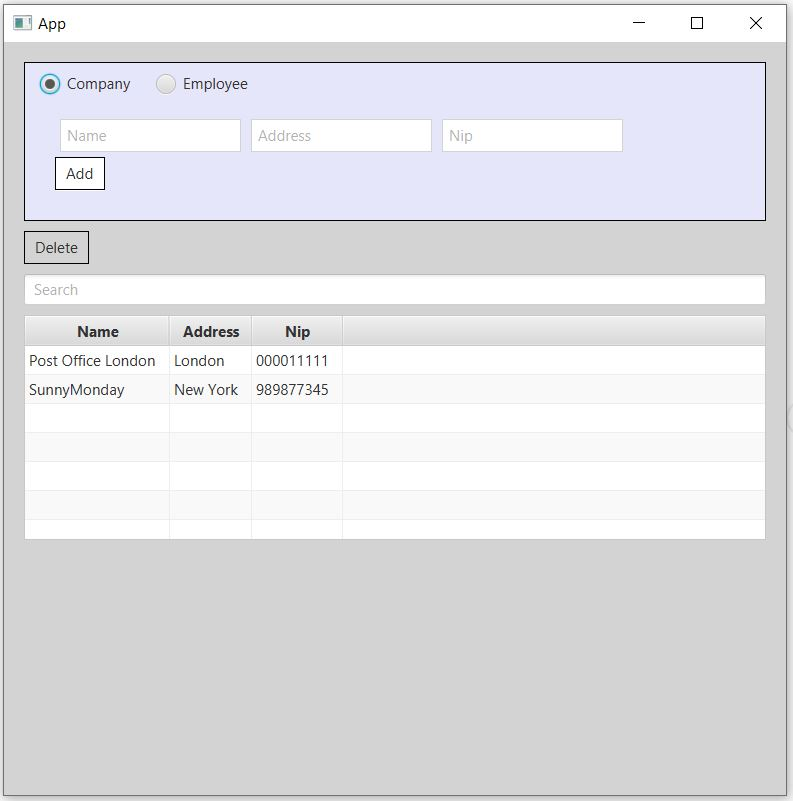
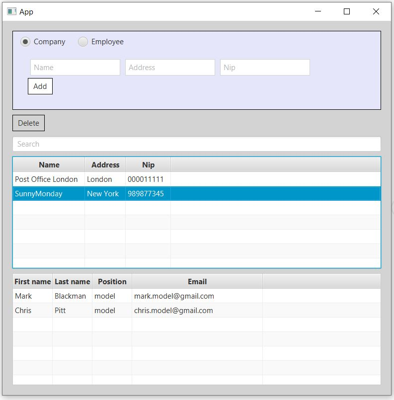
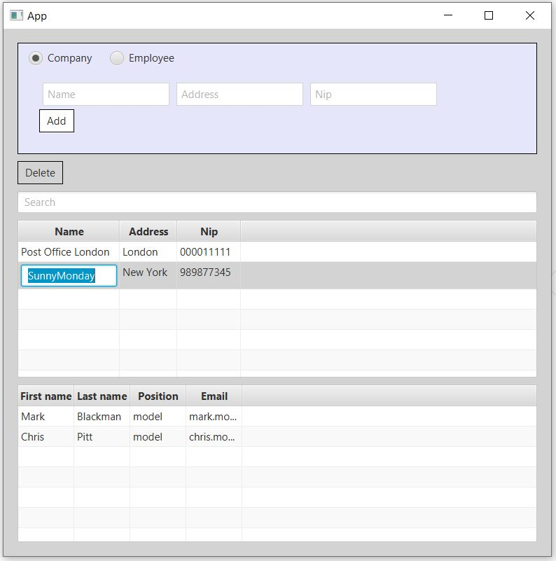

# javaFXApp

## Table of contents
* [General info](#general-info)
* [Technologies](#technologies)

## General info

This app allows:
- viewing company and employee data
- adding, removing a company and employees
- editing company data
- search engine
- simpy validations of the first name, last name, nip
- The application includes tests

## Screenshots

### App

- Company table with Employees table

- Edit company

## Technologies
* [Spring Boot] - version 2.5.4
* [JavaFx] 
